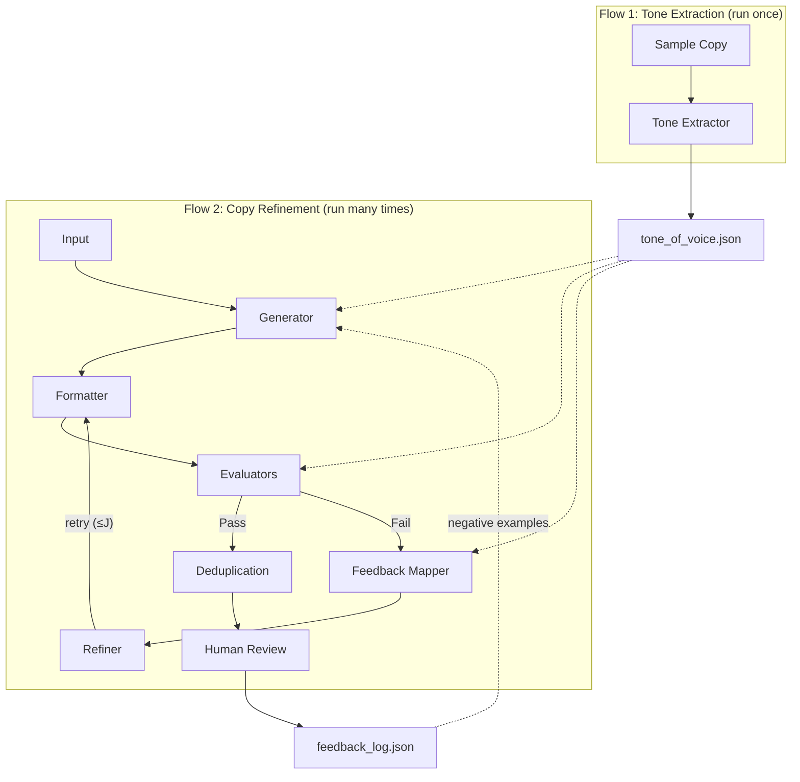

# Iterative Copywriter

A Docker-based [Langflow](https://langflow.org/) project implementing the iterative copy refinement framework from [LLM-driven Constrained Copy Generation through Iterative Refinement](https://arxiv.org/html/2504.10391v1).

The framework generates marketing copy under constraints (length, keywords, tone of voice, coherence, topic relevance, lexical ordering, punctuation, off-brand words) and iteratively refines copies that fail evaluation, significantly improving the success rate.

## Architecture

The system uses two flows that share a persistent tone guidelines file:



## Quick Start

```bash
cp .env.example .env
```

Edit `.env` to add your OpenAI API key, then:

```bash
docker compose up --build
```

Open Langflow at [http://localhost:7860](http://localhost:7860).

## Custom Components

Nine custom Langflow components are available in the sidebar:

| Component | Purpose |
|---|---|
| **Tone Extractor** | Analyzes sample copy to extract structured tone of voice guidelines |
| **Copy Generator** | Generates a batch of marketing copies with few-shot example support |
| **Copy Formatter** | Applies configurable rule-based formatting (brand cleanup, punctuation) |
| **Constraint Evaluator** | Checks copy against a configurable set of constraints with preset support |
| **Copy Refiner** | Refines failed copy using feedback-mapped actionable instructions |
| **Iterative Refinement Pipeline** | Orchestrates the full generate-evaluate-refine loop |
| **Diverse Subset Selector** | Removes near-duplicate copies using n-gram or embedding similarity |
| **Human Review Logger** | Presents copies for review and persists feedback for future improvement |

### Tone Extraction (run first)

Before generating copy, you must extract tone of voice guidelines from sample copy:

1. Import `flows/tone_extraction.json` or drag the **Tone Extractor** onto a new canvas
2. Paste your sample marketing copy into the **Sample Copy** input (JSON array of copy objects or plain text, one per line)
3. Set the **Guidelines Output Path** (default: `/app/langflow/guidelines/tone_of_voice.json`)
4. Run the flow

The extractor analyzes the samples and writes structured guidelines covering voice attributes, formality, sentence structure, vocabulary, emotional register, punctuation preferences, and on-brand/off-brand examples.

Re-run this flow whenever the brand voice evolves.

### Using the Pipeline Component

The **Iterative Refinement Pipeline** is the main entry point. It runs the complete loop internally:

1. Drag it onto the canvas
2. Fill in the inputs:
   - **OpenAI API Key**: your key (or use the environment variable)
   - **Topic**: e.g. "free delivery from store"
   - **Persona**: e.g. "budget-conscious families"
   - **Tone Guidelines Path**: path to the guidelines file produced by the Tone Extractor
   - **Copy Structure**: `header` or `header_subheader`
   - **Length Constraints**: JSON like `{"header": {"min": 30, "max": 60}}`
   - **Required/Excluded Keywords**: JSON arrays
   - **Few-Shot Examples**: JSON array of example copies for in-context learning
   - **Batch Size**: number of copies to generate (default 5)
   - **Max Refinements**: iteration limit per copy (default 2)
   - **Evaluator Preset**: `basic`, `standard`, `full`, or `custom`
3. Connect its output to a **Text Output** or **Chat Output** node
4. Run the flow

### Evaluator Presets

| Preset | Evaluators |
|---|---|
| **basic** | length, keywords |
| **standard** | length, keywords, tone |
| **full** | length, keywords, punctuation, off-brand words, tone, coherence, topic relevance, lexical ordering |
| **custom** | user-defined sequence via JSON |

When using **full** or **custom**, configure the additional inputs:
- **Off-Brand Words**: JSON array of words to block (e.g. `["cheap", "bargain", "competitor-name"]`)
- **Punctuation Rules**: JSON object (e.g. `{"no_exclamation_marks": true, "max_commas_per_component": 2}`)
- **Lexical Ordering Rules**: JSON array (e.g. `[{"before": "brand name", "after": "product category"}]`)

### Formatting Rules

The formatter applies configurable brand-specific rules:

```json
{
  "replace_and_with_ampersand": true,
  "remove_serial_commas": true,
  "strip_trailing_periods": true
}
```

Toggle any rule off by setting it to `false`.

### Few-Shot Examples

Provide example copies in the generator to improve first-attempt quality:

```json
[
  {"header": "Get Free Delivery on Every Order"},
  {"header": "Shop Now & Enjoy Free Shipping"}
]
```

For LLM evaluators, provide calibration examples keyed by evaluator name:

```json
{
  "tone": [
    {"copy": "header: Shop now!", "required_tone": "friendly", "pass": false, "reasoning": "Too aggressive"},
    {"copy": "header: Discover great savings today", "required_tone": "friendly", "pass": true, "reasoning": "Warm and inviting"}
  ]
}
```

### Human Review Feedback Loop

1. Run the pipeline to generate copies
2. Wire the output to the **Human Review Logger** component
3. Review copies and enter feedback (e.g. `1: accept`, `2: reject - too salesy`)
4. Feedback is persisted to a JSON log file
5. On subsequent pipeline runs, set the **Feedback Log Path** to load past feedback
6. Rejected copies are used as negative examples in the generator and for evaluator calibration

### Using Individual Components

Build custom flows by wiring the individual components together:

1. **Copy Generator** -- generates raw copies with few-shot support
2. **Copy Formatter** -- cleans up each copy with configurable rules
3. **Constraint Evaluator** -- checks constraints with preset/custom evaluator selection
4. **Copy Refiner** -- fixes failed copies with feedback-mapped instructions
5. **Diverse Subset Selector** -- removes near-duplicates from final set

### Importing the Flows

Two flow configurations are available in the `flows/` directory:

**Tone Extraction** (`flows/tone_extraction.json`):

1. Open Langflow at http://localhost:7860
2. Import `tone_extraction.json`
3. Paste sample copy and run to generate the guidelines file

**Copy Refinement** (`flows/copy_refinement.json`):

1. Import `copy_refinement.json`
2. Fill in your OpenAI API key and adjust parameters
3. Ensure the **Tone Guidelines Path** points to the file generated by the Tone Extraction flow

## Example Configurations

A Campaign-A style configuration (single header, free delivery):

```json
{
  "topic": "free delivery from store",
  "persona": "general audience",
  "tone_guidelines_path": "/app/langflow/guidelines/tone_of_voice.json",
  "copy_structure": "header",
  "length": {"header": {"min": 30, "max": 60}},
  "keywords_required": ["free delivery"],
  "keywords_excluded": ["cheap", "discount"],
  "evaluator_preset": "standard",
  "batch_size": 5,
  "max_refinements": 2
}
```

A Campaign-B style configuration (header + subheader, full evaluators):

```json
{
  "topic": "free shipping with no order minimum",
  "persona": "returning customers",
  "tone_guidelines_path": "/app/langflow/guidelines/tone_of_voice.json",
  "copy_structure": "header_subheader",
  "length": {
    "header": {"min": 20, "max": 40},
    "subheader": {"min": 50, "max": 80}
  },
  "keywords_required": ["free shipping"],
  "keywords_excluded": ["cheap"],
  "evaluator_preset": "full",
  "off_brand_words": ["bargain", "deal of a lifetime"],
  "punctuation_rules": {"no_exclamation_marks": true, "no_all_caps_words": true},
  "lexical_ordering": [{"before": "free shipping", "after": "no minimum"}],
  "batch_size": 10,
  "max_refinements": 2,
  "enable_dedup": true,
  "similarity_threshold": 0.85
}
```

## Project Structure

```
iterative-copywriter/
├── docker-compose.yml          # Langflow service
├── Dockerfile                  # Custom image with components
├── .env                        # OpenAI credentials
├── .env.example                # Credential template
├── components/
│   ├── tone_extractor.py       # Extracts tone guidelines from sample copy
│   ├── tone_guidelines.py      # Shared utility for reading/writing guidelines
│   ├── evaluators.py           # All evaluator functions (length, keywords, tone,
│   │                           #   coherence, topic relevance, lexical ordering,
│   │                           #   punctuation, off-brand words)
│   ├── feedback_mapper.py      # Maps evaluation feedback to actionable instructions
│   ├── deduplication.py        # Diverse subset selection (n-gram + embedding)
│   ├── human_review.py         # Human review logging and feedback persistence
│   ├── copy_generator.py       # Batch copy generation with few-shot support
│   ├── copy_formatter.py       # Configurable rule-based formatting
│   ├── constraint_evaluator.py # Standalone evaluator component with presets
│   ├── copy_refiner.py         # Feedback-mapped refinement
│   └── iterative_pipeline.py   # Full pipeline orchestrator
└── flows/
    ├── tone_extraction.json    # Tone extraction flow
    └── copy_refinement.json    # Copy refinement pipeline flow
```

## Environment Variables

| Variable | Required | Default | Description |
|---|---|---|---|
| `OPENAI_API_KEY` | Yes | - | OpenAI API key |
| `OPENAI_MODEL` | No | `gpt-4o-mini` | Model to use for generation/evaluation |

## Reference

Based on: Vasudevan et al., "LLM-driven Constrained Copy Generation through Iterative Refinement" ([arXiv:2504.10391](https://arxiv.org/html/2504.10391v1))
